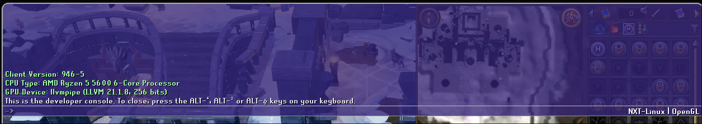

# RS3 silent llvmpipe fallback on Nvidia + Wayland

**Affected:** RuneScape 3 Linux client (`rs2client`) on Nvidia proprietary driver under Wayland
**Effect:** The game runs entirely on the CPU via Mesa's llvmpipe software renderer. No error is shown.
**Root cause:** `rs2client` calls `eglGetDisplay(EGL_DEFAULT_DISPLAY)` (passing `NULL`). This is the legacy EGL API path — GLVND auto-detects the platform from the environment, routes to Mesa, which falls back to llvmpipe when no DRI2 driver exists for `nvidia.ko`. No error code is returned; the game runs on CPU with no indication of failure.

---

## Bug chain

1. **The Wayland compositor starts XWayland** and sets `$DISPLAY` (e.g. `:0`) in the session environment.

2. **`$DISPLAY` is inherited by rs2client** — every process spawned in the session gets it. On Wayland, `SDL_VIDEODRIVER=x11` is also required — without it rs2client fails before the loading screen.

3. **rs2client calls `eglGetDisplay(EGL_DEFAULT_DISPLAY)`**, passing `NULL`. Confirmed by disassembly: `xor %edi,%edi` zeroes the first argument register, then `call eglGetDisplay` is made with nothing modifying `edi` in between. See [Claim 1](#claim-1-rs2client-calls-eglgetdisplaynull).

   `EGL_DEFAULT_DISPLAY` (`NULL`) is the pre-EGL-1.5 "let EGL figure it out" sentinel. Before explicit-platform extensions existed, passing `NULL` was idiomatic: EGL would inspect the environment (e.g. `$DISPLAY`) and return a sensible default.[^egl14] EGL 1.5 introduced `eglGetPlatformDisplay` as the replacement, allowing callers to name the platform and native display explicitly.[^egl15] The older `EGL_EXT_platform_base` extension backported the same idea before 1.5 was finalised.[^extplatform] Passing `NULL` worked fine when a system had exactly one EGL vendor. Under GLVND multi-vendor dispatch the semantics break down — each vendor ICD must independently decide whether to accept or reject the `NULL` handle, and Nvidia rejects it (see step 5 and the [GLVND EGL docs](https://github.com/NVIDIA/libglvnd/blob/master/src/EGL/libegl.md)). rs2client was almost certainly written against a single-vendor EGL assumption and never updated for the GLVND world.

[^egl14]: EGL 1.4 spec, §3.2 "Initialization" — `eglGetDisplay(EGL_DEFAULT_DISPLAY)` is the defined legacy entry point; `EGL_DEFAULT_DISPLAY` is `(EGLNativeDisplayType)0`. <https://registry.khronos.org/EGL/specs/eglspec.1.4.pdf>
[^egl15]: EGL 1.5 spec, §3.2 — `eglGetPlatformDisplay` added; `eglGetDisplay` retained only for backwards compatibility. <https://registry.khronos.org/EGL/specs/eglspec.1.5.pdf>
[^extplatform]: `EGL_EXT_platform_base` extension spec — pre-1.5 mechanism for explicit platform selection via `eglGetPlatformDisplayEXT`. <https://registry.khronos.org/EGL/extensions/EXT/EGL_EXT_platform_base.txt>

4. **GLVND auto-detects the platform from `$DISPLAY`** and selects the X11 EGL platform (`EGL_PLATFORM_X11_KHR`).

5. **Nvidia's EGL rejects `NULL`** — `libEGL_nvidia.so.0` requires an explicit `Display*` pointer and returns `EGL_NO_DISPLAY` for `NULL`.

6. **Mesa accepts `NULL`** — `libEGL_mesa.so.0` accepts `EGL_DEFAULT_DISPLAY` and returns a valid display handle. GLVND uses the first non-`EGL_NO_DISPLAY` response, so Mesa wins despite having lower priority (50) than Nvidia (10).

7. **Mesa probes DRI2 for `nvidia.ko`** — the proprietary Nvidia kernel module exposes no DRI2 interface. Mesa prints `libEGL warning: egl: failed to create dri2 screen` to stderr and falls back to llvmpipe.

8. **llvmpipe fallback** — Mesa returns a valid EGL context backed by the CPU. No error code is returned to the caller — rs2client never sees a failure. See [Claim 3](#claim-3-the-running-game-uses-llvmpipe).

---

## The fix

**This requires a source code patch from Jagex.**

There are two options:

### Option A — Pass explicit X11 display

Replace:
```c
EGLDisplay dpy = eglGetDisplay(EGL_DEFAULT_DISPLAY);
```
with:
```c
// SDL_GetWindowWMInfo already provides x11_display — see Claim 4
EGLDisplay dpy = eglGetPlatformDisplayEXT(EGL_PLATFORM_X11_EXT, x11_display, NULL);
```
With an explicit platform, GLVND routes by vendor priority: Nvidia (10) beats Mesa (50). `eglGetPlatformDisplayEXT` is the pre-EGL-1.5 extension variant (`EGL_EXT_platform_base`), distinct from the core EGL 1.5 `eglGetPlatformDisplay` — which is why Proof 2 shows the core variant absent while the EXT variant is still available. EGLEW loads it at startup via `eglGetProcAddress("eglGetPlatformDisplayEXT")` into the `__eglewGetPlatformDisplayEXT` dispatch table entry, confirmed by Proof 2b.

> **Important:** this one-line change is sufficient if rs2client switches to offscreen (pbuffer) rendering. `poc_egl` Test 2 confirms this path works. However, rs2client currently uses `eglCreateWindowSurface` to render directly into the SDL game window. For that path, the one-line change alone is not enough — see the additional steps below.

#### For window surface rendering (eglCreateWindowSurface)

The EGL spec requires that an X11 window must be created with the **same visual** that the EGL config expects (`EGL_NATIVE_VISUAL_ID`). SDL picks its own visual when it creates the window, and it doesn't match Nvidia's EGL config — `eglCreateWindowSurface` returns `EGL_BAD_MATCH`. `poc_egl` Test 3 demonstrates the full working fix.

The correct sequence:

```c
// 1. Open X display (needed before the SDL window exists)
Display* x11_dpy = XOpenDisplay(NULL);

// 2. Get the Nvidia EGL display
EGLDisplay egl_dpy = eglGetPlatformDisplayEXT(EGL_PLATFORM_X11_EXT, x11_dpy, NULL);
eglInitialize(egl_dpy, ...);

// 3. Choose config and read the visual ID Nvidia requires
EGLConfig cfg;
eglChooseConfig(egl_dpy, attrs_with_EGL_WINDOW_BIT, &cfg, 1, &n);
EGLint visual_id;
eglGetConfigAttrib(egl_dpy, cfg, EGL_NATIVE_VISUAL_ID, &visual_id);

// 4. Create an X11 window with that exact visual
XVisualInfo tmpl = { .visualid = visual_id };
XVisualInfo* vi = XGetVisualInfo(x11_dpy, VisualIDMask, &tmpl, &n);
XCreateWindow(x11_dpy, root, ..., vi->depth, InputOutput, vi->visual, ...);
XSync(x11_dpy, False); // flush before SDL's connection sees the XID

// 5. Wrap the Xlib window in SDL so SDL handles events as normal
SDL_Window* sdl_win = SDL_CreateWindowFrom((void*)xlib_window);

// 6. Create the EGL surface — visual matches, succeeds
EGLSurface surf = eglCreateWindowSurface(egl_dpy, cfg, xlib_window, NULL);
```

The visual matching requirement is specified in the EGL spec: *"for EGL window surfaces, a suitable native window with a matching native visual must be created first"* ([eglIntro](https://registry.khronos.org/EGL/sdk/docs/man/html/eglIntro.xhtml)). The `EGL_EXT_platform_x11` extension spec's example code uses exactly the `eglGetConfigAttrib(EGL_NATIVE_VISUAL_ID)` → `XGetVisualInfo` → `XCreateWindow` sequence as the way to create a compatible window before calling `eglCreatePlatformWindowSurfaceEXT` ([registry.khronos.org](https://registry.khronos.org/EGL/extensions/EXT/EGL_EXT_platform_x11.txt)).

### Option B — Remove the X11 binding entirely (proper fix)

The root issue is that rs2client binds itself to the X11 EGL platform by using the raw X11 `Window` ID from `SDL_GetWindowWMInfo`. If SDL were not forced to the X11 backend (`SDL_VIDEODRIVER=x11`), it would create a native Wayland window instead, and `SDL_GetWindowWMInfo` would return a `wl_display*` and `wl_surface*`. Those can be passed to `eglGetPlatformDisplay(EGL_PLATFORM_WAYLAND_EXT, wl_display, NULL)`, which GLVND routes directly to Nvidia.

`poc_egl_wayland.c` demonstrates this:

```bash
gcc poc_egl_wayland.c -o poc_egl_wayland -ldl
./poc_egl_wayland
```

```
=== TEST 1: eglGetDisplay(NULL) -- the RS3 bug ===
  EGL vendor:  "Mesa Project"
  GL vendor:   "Mesa"
  GL renderer: "llvmpipe (LLVM 21.1.8, 256 bits)"

=== TEST 2: eglGetPlatformDisplay(EGL_PLATFORM_WAYLAND_EXT, wl_display) -- Option B fix ===
  EGL vendor:  "NVIDIA"
  GL vendor:   "NVIDIA Corporation"
  GL renderer: "NVIDIA GeForce RTX 4060 Ti/PCIe/SSE2"
```

Option B requires reworking window and surface creation to use Wayland handles instead of X11 ones, but eliminates the XWayland dependency entirely.

---

## Proofs

### Claim 1: rs2client calls `eglGetDisplay(NULL)`

**Method:** static disassembly — no need to run the binary.

```bash
bash proof_static.sh
```

**Output:**
```
[PROOF 1] Looking for eglGetDisplay call and the xor that zeroes its argument...

  call to eglGetDisplay at offset 0xc7a04b

  xor %edi,%edi at offset 0xc79ffd — sets first arg to 0 (EGL_DEFAULT_DISPLAY)
  No instruction between them modifies edi/rdi.

  Disassembly (0xc79ffd → 0xc7a04b):

    0000000000c79ffd <_ZdaPv@@Base+0x6001d>:
      c79ffd:	31 ff                	xor    %edi,%edi
      c79fff:	48 89 f3             	mov    %rsi,%rbx
      c7a002:	48 81 ec 68 04 00 00 	sub    $0x468,%rsp
      c7a009:	0f b6 46 05          	movzbl 0x5(%rsi),%eax
      c7a00d:	0f b6 56 06          	movzbl 0x6(%rsi),%edx
      c7a011:	66 0f 6f 05 c7 2a 4c 	movdqa 0x4c2ac7(%rip),%xmm0
      c7a019:	c7 44 24 50 25 30 00 	movl   $0x3025,0x50(%rsp)
      c7a021:	c7 44 24 58 26 30 00 	movl   $0x3026,0x58(%rsp)
      c7a029:	66 0f 6f 0d bf 2a 4c 	movdqa 0x4c2abf(%rip),%xmm1
      c7a031:	c7 44 24 60 38 30 00 	movl   $0x3038,0x60(%rsp)
      c7a039:	89 44 24 54          	mov    %eax,0x54(%rsp)
      c7a03d:	0f 29 44 24 30       	movaps %xmm0,0x30(%rsp)
      c7a042:	89 54 24 5c          	mov    %edx,0x5c(%rsp)
      c7a046:	0f 29 4c 24 40       	movaps %xmm1,0x40(%rsp)
      c7a04b:	e8 c0 d2 49 ff       	call   117310 <eglGetDisplay@plt>

[PROOF 2] Checking for eglGetPlatformDisplay (core EGL 1.5) direct import...
  NOT FOUND — rs2client does NOT directly import eglGetPlatformDisplay (core EGL 1.5)
  However, the EXT variant may still be available via EGLEW — see PROOF 2b.

[PROOF 2b] Checking for EGLEW eglGetPlatformDisplayEXT dispatch table entries...
  FOUND: __eglewGetPlatformDisplayEXT
  FOUND: eglGetPlatformDisplayEXT (proc name)
  → EGLEW dispatch table includes __eglewGetPlatformDisplayEXT.
    The proc name string 'eglGetPlatformDisplayEXT' is used by EGLEW to load
    the function pointer via eglGetProcAddress at startup.
    Option A fix (eglGetPlatformDisplayEXT) is available to rs2client.

[PROOF 3] Checking for SDL_GetWindowWMInfo import...
  FOUND — rs2client imports SDL_GetWindowWMInfo
```

`31 ff` is `xor %edi,%edi` — zeroes the first argument register. The call follows immediately after unrelated stack setup instructions, none of which touch `edi` or `rdi`. The argument is `0` = `EGL_DEFAULT_DISPLAY`.

---

### Claim 1b: `eglGetPlatformDisplayEXT` is available to rs2client via EGLEW

**Method:** `strings` on the binary — checks for the EGLEW dispatch table symbol and the proc name string used to load it.

```bash
bash proof_static.sh
```

**Output (from PROOF 2b):**
```
[PROOF 2b] Checking for EGLEW eglGetPlatformDisplayEXT dispatch table entries...
  FOUND: __eglewGetPlatformDisplayEXT
  FOUND: eglGetPlatformDisplayEXT (proc name)
  → EGLEW dispatch table includes __eglewGetPlatformDisplayEXT.
    The proc name string 'eglGetPlatformDisplayEXT' is used by EGLEW to load
    the function pointer via eglGetProcAddress at startup.
    Option A fix (eglGetPlatformDisplayEXT) is available to rs2client.
```

The core EGL 1.5 `eglGetPlatformDisplay` is absent (Proof 2) — it would require a direct link-time import. The EXT variant (`EGL_EXT_platform_base`) is different: EGLEW resolves it at runtime via `eglGetProcAddress`, so it leaves no dynamic symbol table entry and only appears as a string. Both the dispatch table slot (`__eglewGetPlatformDisplayEXT`) and the proc name string (`eglGetPlatformDisplayEXT`) are present, confirming the Option A fix is available.

---

### Claim 2: The EGL display is owned by Mesa, not Nvidia

**Method:** `proof_preload.c` — an LD_PRELOAD library injected via Bolt that intercepts `eglInitialize` and calls `eglQueryString(EGL_VENDOR)` on the display rs2client just initialised.

**How to run:**
```bash
# Build the interceptor
gcc -shared -fPIC -O0 -o proof_preload.so proof_preload.c -ldl

# Add to Bolt's launch (window_launcher_posix.cxx, child block):
#   setenv("LD_PRELOAD", "/path/to/proof_preload.so", false);
# Rebuild Bolt, launch RS3, check log:
cat /tmp/rs3_proof.log
```

**Output (from `/tmp/rs3_proof.log`):**
```
[PROOF 2] eglInitialize succeeded:
          EGL_VENDOR  = "Mesa Project"
          EGL_VERSION = "1.5 Mesa 24.x.x"
```

---

### Claim 3: The running game uses llvmpipe

**Method A:** In-game developer console (`ALT+~`) showing `llvmpipe` as the active renderer:



**Method B:** `proof_preload.c` (same run as Claim 2), intercepting `glGetString`:

```
[PROOF 3] glGetString(GL_RENDERER) = "llvmpipe (LLVM 21.1.8, 256 bits)"
          → llvmpipe — BUG CONFIRMED (software rendering)
[PROOF 3] glGetString(GL_VENDOR) = "Mesa"
```

---

### Claim 4: The X11 window passed to `eglCreateWindowSurface` comes from `SDL_GetWindowWMInfo`

**Method:** `proof_preload.c` intercepts both `SDL_GetWindowWMInfo` (reading `info.x11.window` from the returned struct) and `eglCreateWindowSurface` (reading `$rdx` — the `EGLNativeWindowType` argument). The two values are compared.

**Output (from `/tmp/rs3_proof.log`):**
```
[PROOF 4a] SDL_GetWindowWMInfo:
           subsystem   = 2 (X11)
           x11.display = 0x5605f018e190
           x11.window  = 0x2600037

[PROOF 4b] eglCreateWindowSurface:
           display    = 0x5605f0a0f950
           native_win = 0x2600037
           → MATCH: native_win == SDL_GetWindowWMInfo x11.window ✓
```

The `x11.window` returned by `SDL_GetWindowWMInfo` (`0x2600037`) is identical to the `EGLNativeWindowType` passed to `eglCreateWindowSurface` (`0x2600037`). rs2client uses SDL to manage its window and extracts the raw X11 `Window` ID via `SDL_GetWindowWMInfo` for EGL surface creation.

This matters for the fix: `SDL_GetWindowWMInfo` also provides `x11.display` — a valid X11 `Display*` — at the same point. The Option A fix passes this pointer to `eglGetPlatformDisplayEXT` instead of passing `NULL` to `eglGetDisplay`. The data is already there; the bug is that it goes unused.

---

### Claim 5: GLVND selects X11 platform when `$DISPLAY` is set

**Method:** `proof_glvnd.sh` — inspects the session environment and GLVND's vendor ICD registry.

```bash
bash proof_glvnd.sh
```

**Output:**
```
[STEP 4] Current display environment:
  DISPLAY         = :0
  WAYLAND_DISPLAY = wayland-1
  → Both set: running under Wayland with XWayland active.
    This is the condition under which GLVND selects the X11 platform
    for eglGetDisplay(NULL) — per GLVND EGL docs (libegl.md, 'Display type detection').
    Empirical confirmation follows in Steps 5/6: Mesa wins, which only
    happens on the X11 path (on the Wayland path GLVND routes to Nvidia).

[STEP 4/6] GLVND EGL vendor ICD files (lower number = higher priority):

  /usr/share/glvnd/egl_vendor.d/10_nvidia.json
    vendor_library = libEGL_nvidia.so.0
  /usr/share/glvnd/egl_vendor.d/50_mesa.json
    vendor_library = libEGL_mesa.so.0

  → Nvidia (10_nvidia.json, priority 10) beats Mesa (50_mesa.json, priority 50)
    for platform-EXPLICIT calls (eglGetPlatformDisplay).
    For legacy eglGetDisplay(NULL), the first vendor to return non-NO_DISPLAY wins.
```

This shows the *condition* that triggers X11 platform selection, not the selection itself. Per the [GLVND EGL docs](https://github.com/NVIDIA/libglvnd/blob/master/src/EGL/libegl.md) (§ "Display type detection"): when `$DISPLAY` is set, GLVND picks the X11 platform for `eglGetDisplay(NULL)`; `$WAYLAND_DISPLAY` alone would pick Wayland. Priority (file prefix number) only applies for explicit platform calls.

The empirical confirmation that X11 was actually selected comes from Claim 6: Mesa wins the dispatch, and Mesa only wins on the X11 path. On the Wayland path, `libEGL_nvidia.so.0` accepts a `wl_display*` and returns a valid display — GLVND would route to Nvidia, not Mesa. The fact that Mesa wins proves GLVND took the X11 path.

---

### Claim 6: Nvidia's EGL rejects `NULL` — Mesa wins

**Method:** `poc_egl.c` (run via `proof_glvnd.sh`) — calls `eglGetDisplay(NULL)` through GLVND and checks the resulting EGL vendor and GL renderer.

GLVND queries each vendor ICD in priority order. `libEGL_nvidia.so.0` requires an explicit `Display*` (or Wayland handle) for the X11 platform and returns `EGL_NO_DISPLAY` for a `NULL` native display. `libEGL_mesa.so.0` accepts `EGL_DEFAULT_DISPLAY` and returns a valid handle. GLVND uses the first non-`EGL_NO_DISPLAY` response — Mesa wins despite lower priority (50 vs 10).

The same `poc_egl.c` then calls `eglGetPlatformDisplay(EGL_PLATFORM_DEVICE_EXT, nvidia_device)` to confirm Nvidia's driver itself works fine when given an explicit handle:

```
=== TEST 1: eglGetDisplay(EGL_DEFAULT_DISPLAY) — the RS3 code path ===

  eglGetDisplay: OK
  eglInitialize: OK — EGL 1.5
  EGL vendor:    "Mesa Project"
  GL vendor:     "Mesa"
  GL renderer:   "llvmpipe (LLVM 21.1.8, 256 bits)"
RESULT: SOFTWARE FALLBACK — llvmpipe (CPU, not GPU)

=== TEST 2: eglGetPlatformDisplayEXT(EGL_PLATFORM_X11_EXT) + pbuffer ===

  eglGetPlatformDisplayEXT: OK
  eglInitialize: OK — EGL 1.5
  EGL vendor:    "NVIDIA"
  GL vendor:     "NVIDIA Corporation"
  GL renderer:   "NVIDIA GeForce RTX 4060 Ti/PCIe/SSE2"
RESULT: PASS — hardware GPU

BUG CONFIRMED: Default EGL dispatch falls back to llvmpipe.
               Explicit X11 platform selection gives hardware rendering.
```

TEST 1 winner is Mesa — Nvidia returned `EGL_NO_DISPLAY` for `NULL`. TEST 2 winner is Nvidia — the same X11 display pointer, just passed explicitly, routes GLVND by vendor priority instead of first-responder.

---

### Claim 7: Mesa probes DRI2 for `nvidia.ko` and fails silently

**Method:** `poc_egl.c` stderr (captured by `proof_glvnd.sh`) — Mesa's EGL prints warnings to stderr when it fails to load a DRI2 driver.

```
libEGL warning: pci id for fd 4: 10de:2803, driver (null)
libEGL warning: egl: failed to create dri2 screen
```

`10de` is Nvidia's PCI vendor ID. `2803` is the RTX 4060 Ti's device ID. Mesa queried `nvidia.ko` for its DRI2 driver name and got `(null)` — the proprietary kernel module exposes no DRI2/DRI3 interface. Mesa prints the warnings to stderr and falls back to llvmpipe. No error code is returned to the caller — `eglGetDisplay` and `eglInitialize` both succeed from rs2client's perspective.

---

## Reproducing

### Test environment

| | |
|---|---|
| OS | Fedora 43 (Workstation Edition) |
| Kernel | 6.19.7-200.fc43.x86_64 |
| GPU | NVIDIA GeForce RTX 4060 Ti |
| Driver | NVIDIA 580.126.18 (proprietary) |
| Session | Wayland (GNOME), XWayland active |
| Launcher | Bolt, locally compiled from `3ee336e` |
| rs2client | Downloaded by Bolt at launch time as a `.deb` (stored at `~/.var/app/com.adamcake.Bolt/data/bolt-launcher/Jagex/launcher/rs2client`); binary as of 2026-03-09, sha256 prefix `b1bbd9c3cb2258a3` |

**How Bolt obtains and launches rs2client** (`src/browser/window_launcher_posix.cxx`): the Jagex web UI sends the rs2client `.deb` as POST data; Bolt extracts the binary via libarchive and saves it to its data directory. At launch, Bolt forks and execs the binary with `SDL_VIDEODRIVER=x11` hardcoded in the environment (line 333). This is what guarantees every Bolt user on Wayland hits this bug — `SDL_VIDEODRIVER=x11` is not optional.

### Requirements
- Nvidia proprietary driver on a Wayland session (XWayland active)
- `rs2client` binary from the Jagex/Bolt launcher
- `objdump`, `gcc`

### Static proof (no game needed)
```bash
# Default path assumes Flatpak Bolt install; override with RS2CLIENT=
bash proof_static.sh
```

### GLVND + EGL behaviour (no game needed)
```bash
# Shows $DISPLAY, GLVND ICD priorities, and runs poc_egl.c
bash proof_glvnd.sh
```

### Wayland EGL PoC (Option B fix, no game needed)
```bash
gcc poc_egl_wayland.c -o poc_egl_wayland -ldl
./poc_egl_wayland
```

### Runtime proof

Build the interceptor:
```bash
gcc -shared -fPIC -O0 -o proof_preload.so proof_preload.c -ldl
```

Inject it via Bolt. In `src/browser/window_launcher_posix.cxx`, inside the `LaunchRs3Deb` child block just before `BoltExec(argv)` (around line 341), add:
```cpp
setenv("LD_PRELOAD", "/path/to/proof_preload.so", false);
```

Rebuild and launch:
```bash
cmake --build build
./build/bolt  # launch RS3 through the rebuilt Bolt
```

Check the log after the game reaches the loading screen:
```bash
cat /tmp/rs3_proof.log
```

